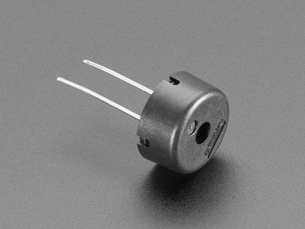

# Firmware Training Session 2
In this session, we'll learn how I2C protocol functions, develop a library for the Haptic Driver on the training board, and use it to interface with the Piezo buzzer onboard.

## Piezo Buzzer
Piezo Buzzer are used for making beeps, tones and alerts, they look like this on your board.


Piezo Buzzer utlises the effect called "Piezoelectric effect". In casual words it means: if you squeeze them, you can make electricity flow through them. The reverse also applies: if electricity flows through, they will squeeze themselves.
Which means, if you apply voltage and then let go of the voltage, it will essentially vibrates and create sound. 
We will use this property to make it generate sound.


## Haptic Driver
Haptic driver provides the necessary signal to make a piezo buzzer "buzz". They're the IC right next to the piezo buzzer. 
We will need to talk to the haptic driver via I2C protocol. 

## I2C
A standard I2C is composed of 4 parts: **Start Condition, address frame, data fram and Stop Condition**

The following is a standard I2C communication. You can understand this after reading the following 4 paragraphs.


### Start Condition
To initiate a communication, the master device will leave SCL high (since SCL is constantly pulled high) and pull SDA low. This will notify all slave devices that a communication is going to happen. 
Just for fun fact if more than one master wish to transmit, whichever pulls SDA low first gains the control.

### Address Frame
After start condition is always the address frame. Usually address frame will have a 7-bit address (note that address is different from address frame), which points to what device and at what register (we'll talk about this later) we want to read/write to. Then it's followed by a R/W bit indicating this is either a read(1) or write(0) action. 
The 9th bit is the NACK/ACK bit. Once the first 8 bits were sent, slave device gain control over SDA line. If slave device did not pull this line low, it means that it either did not get the message or did not know how to interpret it. It is up to the master device to determine what happens next. This applies to both address frame and data frame. 

### Data Frame
Data will be transmitted after the address frame has completed transmission. Either slave/master will drive the SDA line depending on the R/W bit specified earlier in the address frame. There will also be a NACK/ACK bit appended to the end of transmitted data.

### Stop condition
The master will send a stop condition when data tranmission are complete. Stop condition is defined as a 0 to 1 change in SCL followed by 0 to 1 change in SDA. Be aware that this stop condition might be accidentally triggerred during data transmission so don't change SDA when SCL is pulled high.

### Test your learning!
Now get back to the I2C comm image and see if you understand what it means.

## Back to Haptic driver
To control the haptic driver, we need to know where in the haptic driver , and what exactly we need to write into those locations. To figure out all of that, we need the datasheet and Setup Guide
[DRV2605 Setup Guide](http://www.ti.com/lit/an/sloa189/sloa189.pdf)
[DRV2605 Datasheet](http://www.ti.com/lit/ds/symlink/drv2605.pdf)
I know it seems intimidating, but we'll tackle it.

### Device Address and Register Map
First we need to figure out what is the address to the haptic driver. We can find this either in the 2nd page of Setup Guide or 23rd page of datasheet. 

However it turns out that haptic driver has more than a device address, there are many more registers (memory storage unit) in the haptic driver that we should write to and customize the haptic driver. A collection of registers can be found in the **Register Map** section in the datasheet. 

We will cover the function of each register later. As of now, understand that your message need to be **Device address** + **Register Address** + **Data**.

### How to write a simple I2C message to the Haptic Driver
I don't want to reinvent wheels therefore we will use a library called Wire.h that helps send I2C message. 

Now open up a new arduino sketch and add the following at the top
```
#include <Wire.h>
```

We only concern 4 or the functions in this library for now. `Wire.begin()`, which tells that the 2 data pins are now dedicated for I2C communication, `Wire.beginTransmission(Device Address)`, prepare a series of device address and wait for communication, `Wire.write(address/data)`, prepare more bits, appended to the previous address and `Wire.endTransmision()`, send all bits to the slave device.

Therefore if we want to write a 0xFF value to the register at address 0x16 in Haptic driver, this is what we need to do.

```
Wire.begin();                 // Be aware that this only need to happen once while the 
//following commands must be used everytime you try to send an I2C message
Wire.beginTransmission(0x5A); // 0x5A is the device address of the haptic driver, specified in the datasheet
Wire.write(0x16);             // 0x16 is the address of the register we want to write
Wire.write(0xFF);             // 0xFF is the value we decided to write to.
Wire.endTransmision();        // None of the previous codes actually sends anything. This is the only line of code that sends out your transmission
```

### Setting up the Haptic Driver and Understand how we can interface with it
